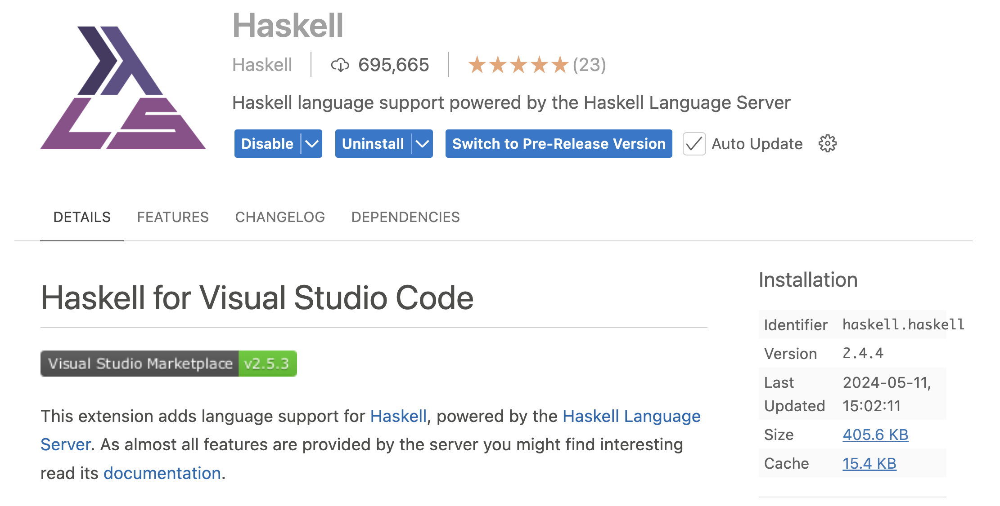

# 하스켈 배움터

## 하스켈 개발 환경 준비하기

### 1. GHCup 설치하기

[GHCup](https://www.haskell.org/ghcup/)은 하스켈에 필요한 컴파일러와 프로젝트 관리 도구, 편집기를 위한 언어 서버등을 
쉽게 설치하고 버전을 관리할 수 있는 프로그램입니다. 터미널을 열어 다음 명령어를 실행하면 설치됩니다.

```sh
$ curl --proto '=https' --tlsv1.2 -sSf https://get-ghcup.haskell.org | sh
```

설치하고나서 터미널에서 다음 명령어를 입력해 터미널 그래픽 인터페이스를 실행합니다.

```sh
$ ghcup tui
```

여기서 `GHCup`, `Stack`, `HLS`, `cabal`, `GHC`를 설치하고 버전 관리할 수 있습니다. 모두 `recommended`가 표시되어 
있는 버전을 설치하면 됩니다. 위, 아래 키로 원하는 버전에 위치시키고 `i`를 눌러 설치합니다. 여러 버전을 설치할 수 있기 때문에 
특정 버전을 사용하려면 커서를 위치시키고 `s`를 누르면 됩니다. 종료하려면 `q`를 누르면 됩니다.

* Stack: 하스켈 프로젝트 관리도구
* HLS: 편집기를 위한 하스켈 언어 서버
* cabal: 하스켈 프로젝트 관리도구 (Stack에서 사용)
* GHC: 하스켈 컴파일러


### 2. VSCode 하스켈 확장 설치하기

하스켈은 HLS를 지원하는 여러 편집기를 쓸 수 있습니다. 배움터에서는 하스켈 개발자들이 가장 많이 쓰고 있는 VSCode와 하스켈 
확장을 설치해서 진행하겠습니다. 시간이 여유롭다면 사용하시는 편집기에 HLS를 연동해 설정해 보시는 것도 좋을 것 같습니다.

VSCode(또는 Cursor)에서 `Haskell` 키워드로 확장을 검색해 다음과 같이 생긴 공식 `Haskell` 확장을 설치합니다.



VSCode 하스켈 확장은 기본 값으로 최신 HLS를 다운로드 합니다. 하지만 위에서 GHCup으로 HLS를 설치했기 때문에 따로 받을 필요가
없습니다. 그리고 GHCup에서 지정한 HLS 버전을 사용해야 합니다. 그래서 VSCode 설정인 `settings.json` 파일을 열어 다음과 
같이 HLS를 GHCup에서 설치한 버전을 쓰도록 지정해줘야 합니다.

```json
{
  ...
  "haskell.manageHLS": "GHCup",
  ...
}
```

### 3. Hello World 프로젝트 만들고 기본 의존성 설치하기

하스켈을 처음 컴파일하면 시간이 오래 걸립니다. 기본 의존성을 다운로드 받고 환경에 맞춰 컴파일을 해야하기 때문입니다. (물론 미리
컴파일 된 버전을 쓰는 방법도 있습니다. 하지만 여기서 다루진 않습니다.) 그래서 새로운 프로젝트를 만들고 다음 명령어로 빌드를
해주면 배움터를 빠르게 진행하는데 도움이 됩니다.

터미널에서 다음 명령어로 `hello` 프로젝트를 만들고 실행을 합니다.

```sh
$ stack --resolver lts-21.25 new hello simple
...
... 어쩌고저쩌고
...
$ cd hello
$ stack run
...
... 오래 걸립니다 ...
...
hello world
$
```

시간이 걸리고 마지막 줄에 `hello world`가 출력되면 잘 된 것입니다.